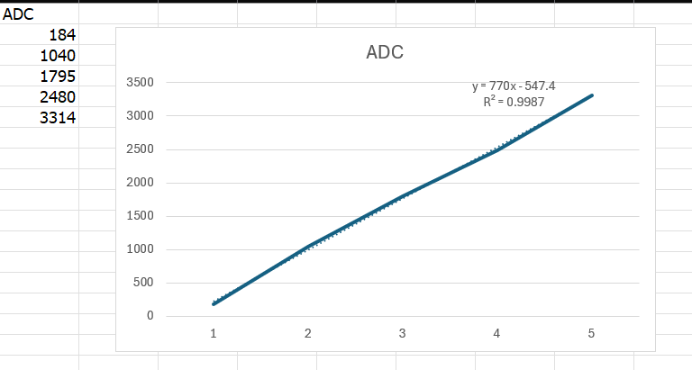

# **ขั้นตอนที่ 3 อ่านค่า ADC (ESP-IDF)**

Link youtube

https://youtu.be/Wc-XRZwJbwo

---

#  **ขั้นตอนที่ 4 เก็บข้อมูลคาลิเบรต**

หมุน POT ให้ตรงกับมุมบนกระดาษ แล้วบันทึกค่า ADC

| มุม (°) | ค่า ADC(คาดการณ์) | ค่า ADC ที่อ่านได้ |
| :-----: | :---------------: | ------------------ |
|    0    |        180        |      184          |
|   45    |       1100        |      1040          |
|   90    |       2100        |      1795          |
|   135   |       3000        |      2480          |
|   180   |       3900        |      3314          |

---

# **ขั้นตอนที่ 5 แปลงค่า ADC → มุมจริง**

**ตัวอย่าง**

$ADC_{min} = 180$

$ADC_{max} = 3900$

$θ_{max} = 180°$

$$angle=(ADC−180)⋅\frac{180}{3720}
$$

---

# **ขั้นตอนที่ 6 แสดงผลมุมแบบเรียลไทม์ (ESP-IDF)**

Link youtube

https://youtube.com/shorts/cO2UWGN4ocY?feature=share

---
# **ขั้นตอนที่ 7 ตรวจสอบความแม่นยำ**

ให้นักศึกษาทดสอบมุมแบบสุ่ม

1. หมุนไปที่มุมที่คาดไว้
2. อ่านค่ามุมจาก ESP32
3. เปรียบเทียบกับมุมบนกระดาษ
4. บันทึก error

| มุมกระดาษ (°) | ค่ามุมจาก ESP32 |
| :-----: | :---------------:  | 
|    0    |      0.9           |
|   45    |      40.3          |
|   90    |      72.2          |
|   135   |      106.7         |
|   180   |      140.1         |

Error = 18.32

---