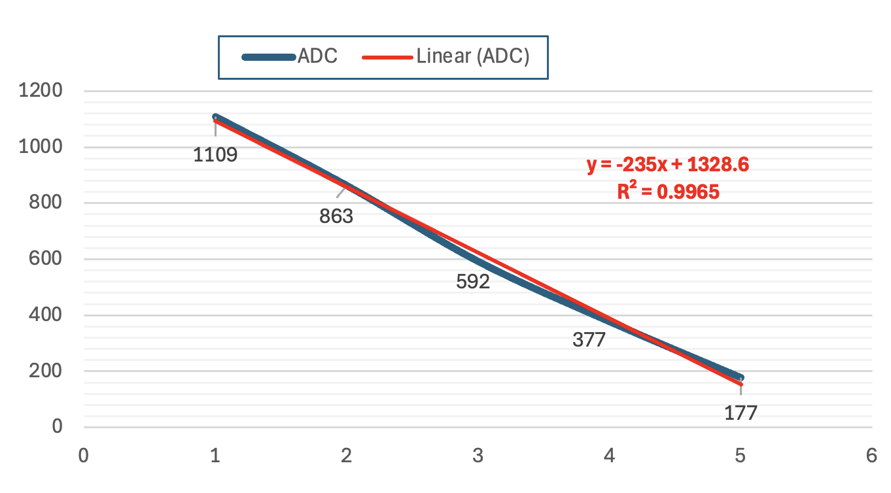

# 🔌 Week 02 — Analog Sensors & Calibration (ESP32)

> **วิชา:** Internet of Things (IoT)
> **สัปดาห์ที่:** 2 — Analog Sensors and Transducers
> **บอร์ด:** ESP32 WROOM DevKit
> **Framework:** ESP-IDF v6.0.2

---
> **Name:** นายกฤตนัย บุญน้อย 67030011
## 📺 สาธิตการทดลอง

[](https://youtu.be/It4R8-jDuS0)

> คลิกรูปด้านบน หรือ [คลิกที่นี่](https://youtu.be/It4R8-jDuS0) เพื่อดูวิดีโอสาธิตการทดลอง

#### 📈 กราฟความสัมพันธ์ ADC vs มุม



สมการ Linear Regression จากข้อมูลคาลิเบรต:

$$y = -235x + 1328.6$$

| พารามิเตอร์   | ค่า        | ความหมาย                                       |
| ---------------| ------------| ------------------------------------------------|
| **Slope**     | -235       | ค่า ADC ลดลง 235 หน่วย ต่อมุมที่เพิ่มขึ้น 1°   |
| **Intercept** | 1328.6     | ค่า ADC เมื่อมุม = 0° (ตามสมการ)               |
| **R²**        | **0.9965** | ความสัมพันธ์เชิงเส้นสูงมาก (1.00 = สมบูรณ์แบบ) |

> **แปลผล R² = 0.9965:** ความสัมพันธ์ระหว่างมุมและ ADC มีความเป็นเส้นตรงถึง **99.65%** อย่างไรก็ตามความเบี่ยงเบนเล็กน้อยที่เหลือ (0.35%) ซึ่งเกิดจากลักษณะ Non-linear ของ POT และความคลาดเคลื่อนเชิงกล ทำให้ต้องใช้ **Piecewise Interpolation** แทนการใช้สมการเส้นตรงสมการเดียว เพื่อลด Error ที่มุมกลางลงจาก +52° ให้เหลือ 0°

---

## 📁 โครงสร้างโปรเจกต์

```
Week-02-Sensors-and-calibration/
├── ESP32_Project/
│   ├── LED_Blink/          # Lab 1: ไฟ LED กระพริบ (Hello World ESP-IDF)
│   ├── POT_ADC_Read/       # Lab 2: อ่านค่า ADC จาก Potentiometer
│   └── POT_Angle_Measure/  # Lab 3: วัดมุมจาก POT พร้อม Calibration
├── LabSheet/
│   ├── Lab -- POT Angle Calibration Th.md   # ใบงานหลัก (ภาษาไทย)
│   ├── Voltage Divider.md                   # ทฤษฎี Voltage Divider
│   ├── ESP32_WROOM_DEVKIT.md                # Pinout และข้อมูล ESP32
│   └── ESP32 from scrash.md                 # คู่มือ ESP-IDF เริ่มต้น
├── Calibration_Data/       # ข้อมูลการคาลิเบรตที่บันทึกไว้
└── voltage divider.drawio.svg  # แผนผัง Voltage Divider
```

---

## 🧪 สรุปการทดลอง

### Lab 1 — LED Blink
ทดสอบ ESP-IDF framework เบื้องต้น ด้วยการทำให้ LED บนบอร์ดกระพริบ ผ่าน GPIO API

**ไฟล์:** [`ESP32_Project/LED_Blink/main/main.c`](ESP32_Project/LED_Blink/main/main.c)

---

### Lab 2 — POT ADC Read
อ่านค่าแรงดันอนาล็อกจาก Potentiometer ผ่านขา **GPIO 34 (ADC1 Channel 6)** และแสดงผลค่า ADC (0–4095) ทาง Serial Monitor

- ใช้ API: `esp_adc/adc_oneshot.h` (ESP-IDF v6.0+)
- ความละเอียด: 12-bit (0–4095)
- Attenuation: `ADC_ATTEN_DB_12` (รองรับ 0–3.3V)

**ไฟล์:** [`ESP32_Project/POT_ADC_Read/main/main.c`](ESP32_Project/POT_ADC_Read/main/main.c)

---

### Lab 3 — POT Angle Measure (พร้อม Calibration)
วัดมุมหมุนของ Potentiometer (0°–180°) โดยใช้เทคนิค **Piecewise Linear Interpolation** และ **Moving Average Filter** เพื่อแก้ปัญหาความไม่เป็นเส้นตรง (Non-linearity) ของ POT

**ไฟล์:** [`ESP32_Project/POT_Angle_Measure/main/main.c`](ESP32_Project/POT_Angle_Measure/main/main.c)

#### ⚙️ เทคนิคที่ใช้

| เทคนิค | วัตถุประสงค์ |
|---|---|
| **Piecewise Linear Interpolation** | แบ่งช่วงการวัดเป็น 4 ช่วง (0→45→90→135→180°) แต่ละช่วงใช้สมการเส้นตรงของตัวเอง แก้ปัญหา Non-linearity ของ POT |
| **Moving Average Filter (32 samples)** | อ่านค่า ADC 32 ครั้งแล้วหาค่าเฉลี่ย ลดสัญญาณรบกวน (Noise) ทำให้ค่าที่แสดงนิ่งและเสถียร |
| **Self-Calibration (Interactive)** | คาลิเบรตสดทุกครั้งที่บูต โดยผู้ใช้หมุน POT ไปยังแต่ละจุดอ้างอิงแล้วกด Enter บันทึกค่า ADC จริง ณ ขณะนั้น แก้ปัญหาตัวถัง POT ขยับในแต่ละครั้ง |

#### 📊 ผลการคาลิเบรต (ข้อมูลจริงจากการทดลอง)

| มุมบนกระดาษ | ค่า ADC (เฉลี่ย 64 ครั้ง) |
| :-----------:| :-------------------------:|
| **0°**      | 4095                      |
| **45°**     | 2874                      |
| **90°**     | 1383                      |
| **135°**    | 841                       |
| **180°**    | 661                       |

> **สังเกต:** ค่า ADC ที่อ่านได้ **กลับทิศ** กับค่าที่คาดการณ์ในใบงาน (ใบงานคาดว่า ADC จะเพิ่มตามมุม แต่จริงๆ ADC **ลดลง**เมื่อมุมเพิ่มขึ้น) เนื่องจากการต่อสายของ POT กลับด้านกัน ซึ่งไม่มีผลต่อการทำงาน เพราะโค้ดคาลิเบรตจะรองรับทั้งสองทิศอัตโนมัติ


---


## 🔌 การต่อวงจร

```
ESP32 GPIO 34 (ADC1_CH6) ────── ขากลาง (Wiper) ของ POT
3.3V ──────────────────────────── ขาปลายข้างหนึ่งของ POT
GND ────────────────────────────── ขาปลายอีกข้างของ POT
```

> ⚠️ **หมายเหตุ:** GPIO 34 เป็น Input-only ห้ามต่อเป็น Output และรับแรงดันได้สูงสุด 3.3V เท่านั้น

---

## 🚀 วิธี Build และ Flash

```bash
# เข้าไปยัง project ที่ต้องการ
cd ESP32_Project/POT_Angle_Measure

# Build + Flash + เปิด Monitor ในคำสั่งเดียว
idf.py -p /dev/tty.usbserial-0001 flash monitor
```

เมื่อบอร์ดบูตขึ้นมา จะเข้าสู่ **โหมดคาลิเบรต** อัตโนมัติ:
1. หมุน POT ไปที่ **0°** บนกระดาษ → กด **Enter**
2. หมุน POT ไปที่ **45°** → กด **Enter**
3. ทำซ้ำจนครบ 5 จุด (0°, 45°, 90°, 135°, 180°)
4. ระบบจะแสดงค่ามุมแบบเรียลไทม์ทันที

---

## 📖 อ่านเพิ่มเติม

- [ใบงาน: POT Angle Calibration (ภาษาไทย)](LabSheet/Lab%20--%20POT%20Angle%20Calibration%20Th.md)
- [ทฤษฎี Voltage Divider](LabSheet/Voltage%20Divider.md)
- [ESP32 WROOM Pinout](LabSheet/ESP32_WROOM_DEVKIT.md)
- [ESP-IDF Documentation](https://docs.espressif.com/projects/esp-idf/en/latest/)
